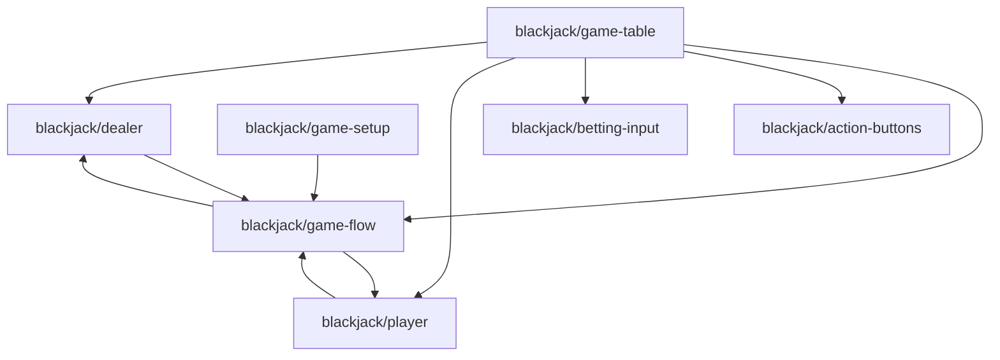

# ドメイン依存関係図

## 凡例
- 実線の矢印: 正常な依存関係
- 点線の矢印: アーキテクチャルール違反
- 赤色のノード: 違反を含むドメイン

## 統計
- ドメイン数: 7
- 依存関係数: 10
- 違反数: 0
- 循環依存: 2

## 循環依存

1. blackjack/game-flow → blackjack/player → blackjack/game-flow
2. blackjack/dealer → blackjack/game-flow → blackjack/dealer
